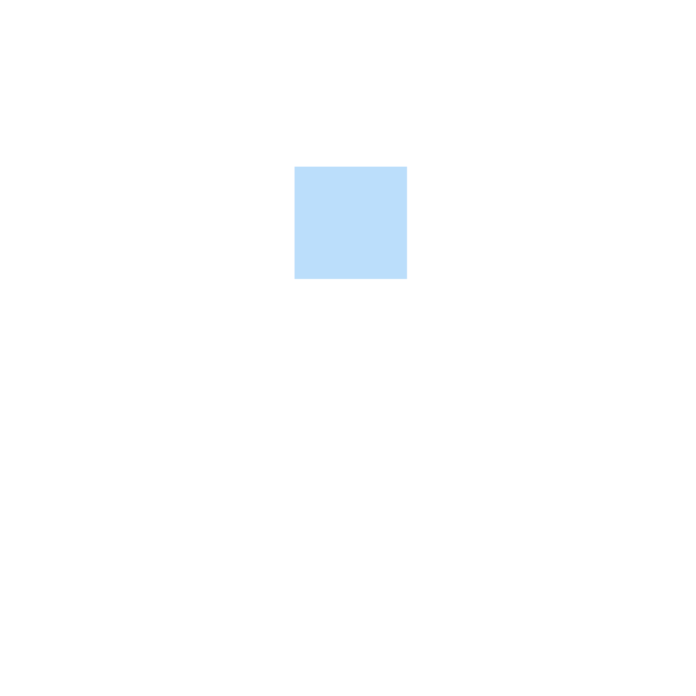

# ⚠️ ATTENTION ⚠️
THIS VERSION IS STILL IN *ALPHA,* MEANING IT WILL HAVE SOME BUGS AND IT IS UNSTABLE!

FPS Alternatives is a tool that can increase FPS by changing the FPS engine.

[Download here.](http://paste.ubuntu.com/108037)

If the game is lagging randomly, you can use *FPS Alternatives!*
It can Increases your FPS if your game is lagging by changing the FPS' engine on the game you're playing.

Currently, these codes are not stable yet. you can submit pull request to fix the code.

### All FPS versions
- Triplex - Triples your FPS! ($2.99)
- Doublex - Doubles your FPS! ($1.99)
- Framprove - Improves your FPS! (Free)

NOTICE:
- FPS alternatives can be used if your fps is below 20, if you use fps alternatives if your game fps' is above 21 fps, it will crash.
- Doesn't work at Windows 8 and Linux 32bits.
- *This Version is in alpha meaning it will have some bugs.*

### Credits
- AlvarroPewz24 - Main Coder
- jackrayYml - Second Coder
- Luketrash2 - Testing
- Dromoneo - Testing
- Jeddersky - Logo
- Nico - Website
- Jydsey - Base repo
- KingNether - Porting Help
